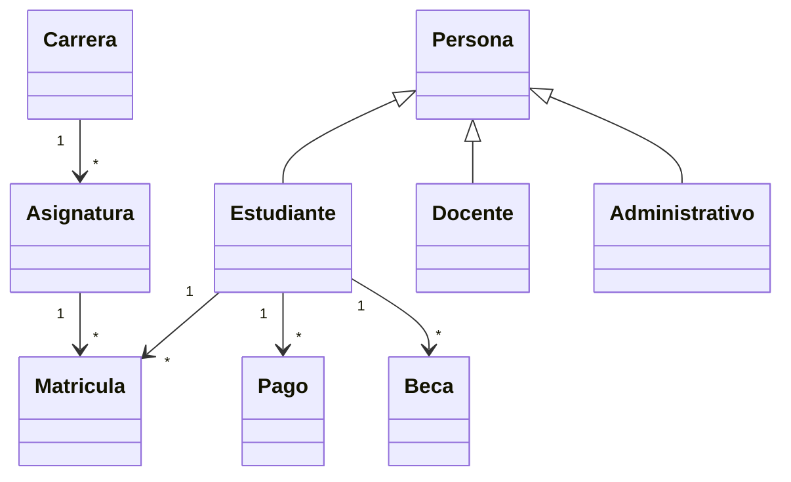
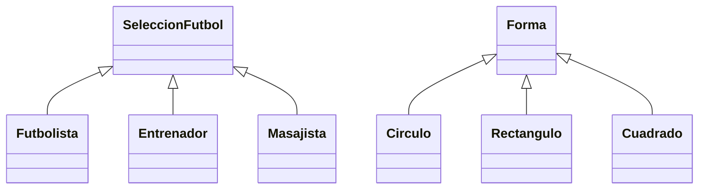

# Diagramas de clases · RegistroUdeM

## Jerarquía principal

```mermaid
classDiagram
    Persona <|-- Estudiante
    Persona <|-- Docente
    Persona <|-- Administrativo
    Carrera "1" --> "*" Asignatura
    Estudiante "1" --> "*" Matricula
    Asignatura "1" --> "*" Matricula
    Estudiante "1" --> "*" Pago
    Estudiante "1" --> "*" Beca
```

## Laboratorio Clase 03

```mermaid
classDiagram
    SeleccionFutbol <|-- Futbolista
    SeleccionFutbol <|-- Entrenador
    SeleccionFutbol <|-- Masajista
    Forma <|-- Circulo
    Forma <|-- Rectangulo
    Forma <|-- Cuadrado
```
